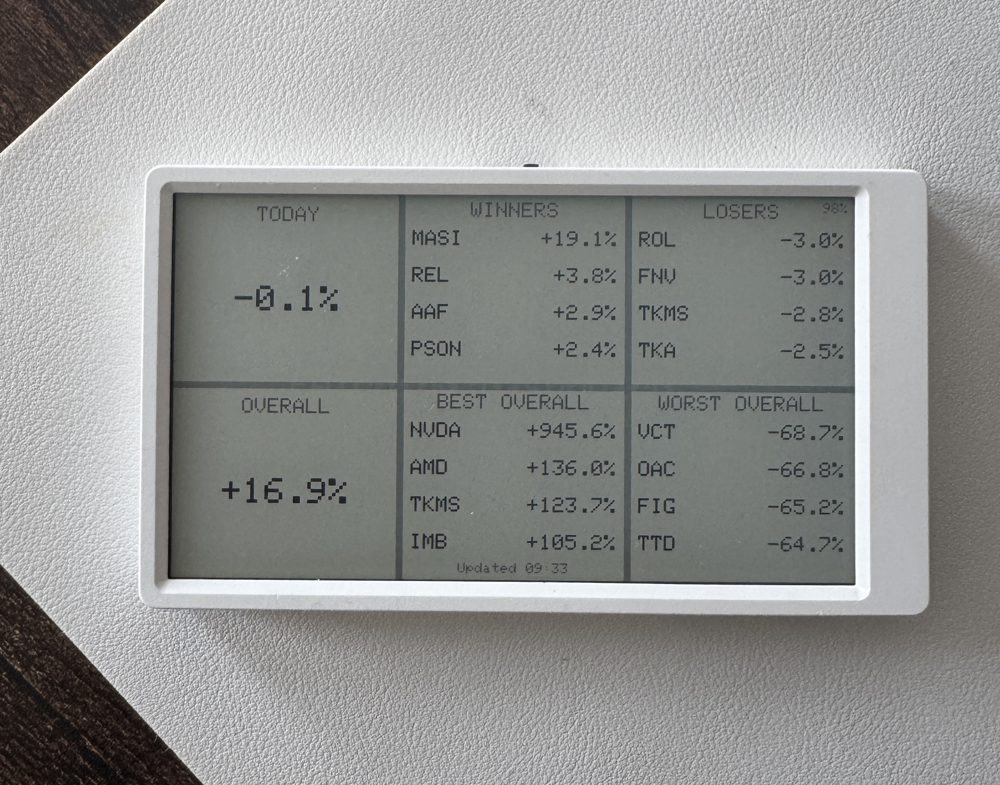

# M5Paper Trading 212 Dashboard

An e-ink dashboard for the [M5Paper](https://docs.m5stack.com/en/core/m5paper_v1.1) that shows your Trading 212 portfolio at a glance. Refreshes every 30 minutes, runs for ~12 weeks on battery.

A Raspberry Pi fetches your portfolio data via the Trading 212 API and serves a small JSON file over your local network. The M5Paper wakes up, grabs the JSON, draws the dashboard, and goes back to sleep.

```
Trading 212 API ──► Raspberry Pi (cron + HTTP server) ──► WiFi ──► M5Paper (e-ink)
```

## What it shows



- **24H P&L** — portfolio rolling 24-hour % change
- **Winners / Losers** — top & bottom 4 stocks by rolling 24-hour % change
- **Overall P&L** — total unrealised P&L %
- **Best / Worst Overall** — top & bottom 4 stocks by all-time % change
- **Battery** — tiny overlay, top-right corner
- **Updated** — last refresh time, bottom-center

## Hardware

### M5Paper v1.1

| Component | Spec |
|-----------|------|
| MCU | ESP32-D0WDQ6-V3, 240 MHz dual-core, 16 MB flash, 8 MB PSRAM |
| Display | 4.7" e-ink, 960×540, 16 grayscale levels, IT8951 controller |
| Touch | GT911 capacitive (not used in this project) |
| Sensors | SHT30 (temp/humidity), BM8563 (RTC) |
| Battery | 1150 mAh LiPo, USB-C charging |
| WiFi | 2.4 GHz only (ESP32 hardware limitation) |
| Sleep draw | ~10 µA (only RTC on) |
| USB | CP2104 / CH9102 USB-to-serial (Type-C) |

The e-ink display retains its image with zero power — like printed paper. The device is fully off between refreshes; only the RTC ticks to trigger the next wake.

### Raspberry Pi

Any Pi that can run Python and stay on your network. Serves the dashboard JSON over HTTP on port 8080.

## Setup

### 1. Get Trading 212 API credentials

In the Trading 212 app, open **Settings -> API** and create your API key + secret.

### 2. Build & flash the firmware

You need [PlatformIO](https://platformio.org/install) and a Python venv:

```bash
uv venv .venv
source .venv/bin/activate
uv pip install pip platformio
```

Before building, make sure your local checkout has a populated `.env` (`cp .env.example .env`) with `TRADING212_API_KEY`, `TRADING212_API_SECRET`, `WIFI_SSID`, `WIFI_PASS`, and `DASHBOARD_URL`.

Connect the M5Paper via USB-C, then:

```bash
cd firmware
pio run -t upload
```

PlatformIO will auto-detect the serial port. If you have multiple serial devices, create `firmware/platformio_override.ini`:

```ini
[env:m5paper]
upload_port = /dev/cu.usbserial-XXXXX
monitor_port = /dev/cu.usbserial-XXXXX
```

### 3. On the Raspberry Pi: clone and configure `.env`

```bash
git clone https://github.com/12ian34/m5paper-dash-trading212.git
cd m5paper-dash-trading212
cp .env.example .env
```

Edit `.env` in that Pi checkout:

```
TRADING212_API_KEY=your_api_key
TRADING212_API_SECRET=your_api_secret
WIFI_SSID=your_wifi_ssid
WIFI_PASS=your_wifi_password
DASHBOARD_URL=http://your-pi-ip:8080/dashboard.json
```

### 4. On the Raspberry Pi: sync and install cron

```bash
cd server
uv sync
bash setup_cron.sh
```

`setup_cron.sh` auto-detects its own `server/` path and works from fish/zsh/bash when run as `bash setup_cron.sh`.

This installs two cron jobs:
- **Every 30 min** (`29,59 * * * *`): fetches your T212 data and writes `dashboard.json`
- **On boot** (`@reboot`): starts the HTTP server on port 8080

### 5. First boot

Once flashed, the M5Paper will:

1. Show "BOOTING..."
2. Connect to WiFi
3. Fetch `dashboard.json` from the Pi
4. Draw the dashboard
5. Sync the RTC via NTP
6. Shut down and set a 30-minute wake alarm

It repeats this cycle indefinitely. Press the **rear reset button** for an immediate refresh.

## How it works

### M5Paper lifecycle

The device is fully powered off between refreshes. Each cycle:

1. **RTC alarm fires** → cold boot
2. WiFi connect (~2-3s)
3. HTTP GET to Pi (~1s)
4. Parse JSON, draw dashboard
5. NTP time sync (runs *after* draw — see note below)
6. `M5.shutdown()` → sets next alarm, cuts power
7. E-ink retains image with zero power

**Total awake time: ~5-10 seconds per cycle.**

On USB power, `M5.shutdown()` can't fully cut power (USB keeps the ESP32 alive). The firmware handles this by calling `ESP.restart()` after the refresh interval elapses.

### Pi side

`update_dashboard.py` runs every 30 minutes via cron:

1. Fetches account summary from `GET /equity/account/summary`
2. Fetches positions from `GET /equity/positions`
3. Stores snapshot history in `rolling_24h_baseline.json` and computes rolling 24-hour % change
4. Computes per-stock rolling 24-hour % and all-time % change
5. Writes `dashboard.json` with top 4 / bottom 4 for each category

`serve.py` is a threaded HTTP server that serves the JSON file. It uses `ThreadingTCPServer` because Python's built-in `http.server` is single-threaded and hangs when the ESP32 makes incomplete connections.

### Rolling 24-hour tracking

Trading 212 doesn't have a native rolling "24-hour portfolio change" endpoint. The Pi tracks it:

- Every cron run appends a timestamped snapshot: portfolio value + per-position prices
- It compares "now" to the snapshot from ~24 hours ago
- It keeps ~72 hours of snapshots on disk (`rolling_24h_baseline.json`)
- During warm-up (<24h history), it uses the earliest available snapshot

## Battery life

| Parameter | Value |
|-----------|-------|
| Battery capacity | 1150 mAh |
| Sleep draw | ~10 µA |
| Wake cycle | ~120 mA for ~8s = ~0.27 mAh |
| Refresh interval | 30 minutes |
| Daily consumption | ~14 mAh |
| **Estimated battery life** | **~80 days / ~12 weeks** |

## Project structure

```
├── firmware/
│   ├── src/main.cpp           # M5Paper firmware (Arduino/ESP32)
│   ├── platformio.ini         # PlatformIO config
│   └── load_env.py            # Build script: injects .env as compiler flags
├── server/
│   ├── update_dashboard.py    # Fetches T212 data, writes dashboard.json
│   ├── serve.py               # Threaded HTTP file server
│   ├── setup_cron.sh          # Installs cron jobs on the Pi
│   └── pyproject.toml         # Python dependencies for `uv sync`
├── .env.example               # Template for required environment variables
└── README.md
```

## Troubleshooting

**M5Paper shows "WiFi Failed"**
- Check your SSID/password in `.env`
- Must be a 2.4 GHz network (ESP32 doesn't support 5 GHz)
- Device will retry on the next 30-minute cycle

**M5Paper shows "HTTP -1" or similar**
- Check the Pi is running: `curl http://your-pi-ip:8080/dashboard.json`
- Verify `DASHBOARD_URL` in `.env` matches the Pi's IP
- Ensure the M5Paper and Pi are on the same network

**Dashboard shows 0% for all 24h movers**
- Normal right after first setup/redeploy (not enough 24h history yet)
- Also normal when markets are closed and prices haven't changed

**Screen stays on "Fetching dashboard..."**
- If on battery: this was a known issue caused by NTP blocking before draw. The firmware now runs NTP *after* drawing. If you see this, ensure you're running the latest firmware.

**Serial port not found during flash**
- Run `ls /dev/cu.usb*` to find your device
- Create `firmware/platformio_override.ini` with the correct port
- Try a different USB-C cable (some are charge-only)

### Cron maintenance

- See only dashboard cron lines:  
  `crontab -l | grep -E 'update_dashboard.py|serve.py 8080'`
- Remove old dashboard cron entries before reinstalling:
  `crontab -l | grep -v -E 'update_dashboard\\.py|serve\\.py 8080|http\\.server 8080' | crontab -`
- Reinstall cleanly from repo checkout:
  `cd /path/to/your/checkout/server && bash setup_cron.sh`

## Notes

- Uses `M5.shutdown()` for sleep, NOT ESP32 deep sleep — deep sleep is unreliable on M5Paper (see [M5Paper skill](.cursor/skills/m5paper/SKILL.md) for details)
- Board is `m5stack-fire` in PlatformIO (no official M5Paper board definition)
- The M5Paper and Pi don't need to be time-synced — the Pi writes JSON on its own schedule, the M5Paper grabs whatever is there
- The `setup_cron.sh` script preserves existing cron jobs when adding new ones
